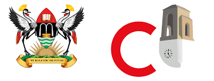
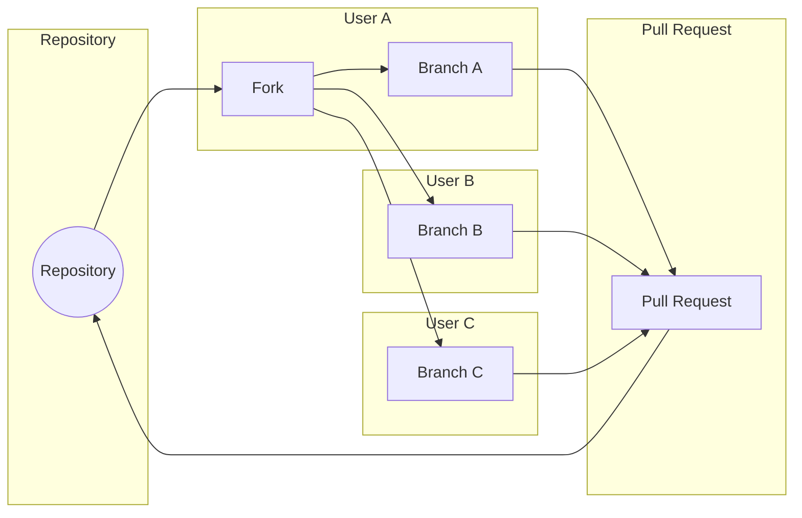

# Recess Project Template

## Table of Contents
- [Introduction](#introduction)
- [Documentation](#documentation)
- [Reports and Presentations](#reports-and-presentations)
- [Resources](#resources)
- [Getting Started](#getting-started)
- [Contributing](#contributing)
- [License](#license)

## Introduction
Welcome to the Recess Project Template! This repository serves as a structured template for working on your `recess projects` in `groups of five`. It provides guidelines and a well-organized file structure to help you efficiently collaborate, manage your individual work, and deliver successful group projects.

### Collaboration Process

---
>> Note: Each Group member has to Own a Branch named as his/her name 

## Documentation
Find detailed project documentation in the [docs](Recess_Project_Template/docs) folder. It includes:
- [Project Overview](./docs/README.md): Get an overview of the project's goals, objectives, and how to use this template effectively.
- [Project Guidelines](./docs/project_guidelines.md): Learn about the best practices for group collaboration, code organization, and documentation.
  
- ## Reports and Presentations

Submit your final project reports and group presentation in the [reports](Recess_Project_Template/reports) folder:

- Individual project reports: [reports/report_Student1.pdf](Recess_Project_Template/reports/report_Student1.pdf) - [reports/report_Student5.pdf](Recess_Project_Template/reports/report_Student5.pdf)
- Group presentation: [reports/group_presentation.pptx](Recess_Project_Template/reports/group_presentation.pptx)

## Resources
The [resources](Recess_Project_Template/resources) folder contains additional resources for the project, including:
- [Images](Recess_Project_Template/resources/images): Store images related to your project (e.g., diagrams, graphics).
- [Datasets](Recess_Project_Template/resources/datasets): If applicable, keep datasets used in your project for reproducibility.

## Getting Started
To begin your recess project, use the `"Use this template"` button to create your individual project repository based on this template. Follow these steps to get started:

1. Clone your individual project repository to your local machine.
2. Collaborate with your group members on the group project within the [src/group_work](Recess_Project_Template/src/group_work) folder.
3. Work on your individual contributions within your respective folders in [src/individual_work](./src/individual_work).
4. Regularly commit and push changes to your repository.
5. Create pull requests for group project changes and get feedback from your team.

## ❗️ Note:
- The project will run for 2 weeks starting on 24th July 2022 to 11th August 2023 till 11:59 pm.
- Email us: jeff.geoff.cis@gmail.com cc. ndigezzalivingstone2@gmail.com and send us the link for the GitHub Repository!

## Contributing
If you want to contribute to this project template or suggest improvements, please follow the guidelines outlined in [CONTRIBUTING.md](./CONTRIBUTING.md). We welcome your contributions and value your feedback!

## License
This project is licensed under the [MIT License](./LICENSE). Feel free to use and modify this template for your own recess projects.

---
